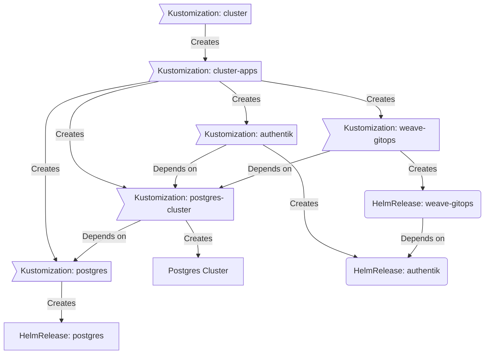

<div align="center">

### My Homelab Repository :snowflake:

_... automated via [Flux](https://fluxcd.io), [Renovate](https://github.com/renovatebot/renovate) and [GitHub Actions](https://github.com/features/actions)_ 🤖

</div>

<div align="center">

[](https://discord.gg/home-operations)&nbsp;&nbsp;
[](https://www.talos.dev/)&nbsp;&nbsp;
[](https://www.talos.dev/)&nbsp;&nbsp;
[](https://fluxcd.io/)&nbsp;&nbsp;
[](https://github.com/ekenheim/ekenheim/actions/workflows/scheduled-renovate.yaml)

</div>

<div align="center">

[](https://status.ekenhome.se)&nbsp;&nbsp;
[](https://status.ekenhome.se/endpoints/external_gatus)&nbsp;&nbsp;
[](https://status.ekenhome.se/endpoints/external_plex)

</div>

<div align="center">

[](https://github.com/kashalls/kromgo/)&nbsp;&nbsp;
[](https://github.com/kashalls/kromgo/)&nbsp;&nbsp;
[](https://github.com/kashalls/kromgo/)&nbsp;&nbsp;
[](https://github.com/kashalls/kromgo/)&nbsp;&nbsp;
[](https://github.com/kashalls/kromgo/)&nbsp;&nbsp;
[](https://github.com/kashalls/kromgo/)&nbsp;&nbsp;
[](https://github.com/kashalls/kromgo/)

</div>

---

## Overview

This is a monorepository for my home Kubernetes clusters.
I try to adhere to Infrastructure as Code (IaC) and GitOps practices using tools like [Ansible](https://www.ansible.com/), [Terraform](https://www.terraform.io/), [Kubernetes](https://kubernetes.io/), [Flux](https://github.com/fluxcd/flux2), [Renovate](https://github.com/renovatebot/renovate), and [GitHub Actions](https://github.com/features/actions).

The purpose here is to learn k8s, while practicing Gitops.

---

## ⛵ Kubernetes

### Installation

My clusters are running on [Talos Linux](https://www.talos.dev) immutable Kubernetes OS. This is a semi-hyper-converged cluster, workloads and block storage are sharing the same available resources on my nodes while I have a separate NAS server with ZFS for NFS/SMB shares, bulk file storage and backups.

### Core Components

- [actions-runner-controller](https://github.com/actions/actions-runner-controller): self-hosted Github runners
- [cilium](https://github.com/cilium/cilium): internal Kubernetes networking plugin
- [cert-manager](https://cert-manager.io/docs/): creates SSL certificates for services in my cluster
- [external-dns](https://github.com/kubernetes-sigs/external-dns): automatically syncs DNS records from my cluster ingresses to a DNS provider
- [external-secrets](https://github.com/external-secrets/external-secrets/): managed Kubernetes secrets using [Bitwarden](https://bitwarden.com/).
- [ingress-nginx](https://github.com/kubernetes/ingress-nginx/): ingress controller for Kubernetes using NGINX as a reverse proxy and load balancer
- [longhorn](https://longhorn.io/): Cloud native distributed block storage for Kubernetes
- [sops](https://toolkit.fluxcd.io/guides/mozilla-sops/): managed secrets for Kubernetes, Ansible, and Terraform which are committed to Git
- [spegel](https://github.com/XenitAB/spegel): stateless cluster local OCI registry mirror
- [tf-controller](https://github.com/weaveworks/tf-controller): additional Flux component used to run Terraform from within a Kubernetes cluster.
- [volsync](https://github.com/backube/volsync): backup and recovery of persistent volume claims

### GitOps

[Flux](https://github.com/fluxcd/flux2) watches the clusters in my [kubernetes](./kubernetes/) folder and makes the changes to my clusters based on the state of my Git repository.

The way Flux works for me here is it will recursively search the `kubernetes/${cluster}/apps` folder until it finds the most top level `kustomization.yaml` per directory and then apply all the resources listed in it. That aforementioned `kustomization.yaml` will generally only have a namespace resource and one or many Flux kustomizations. Those Flux kustomizations will generally have a `HelmRelease` or other resources related to the application underneath it which will be applied.

[Renovate](https://github.com/renovatebot/renovate) watches my **entire** repository looking for dependency updates, when they are found a PR is automatically created. When some PRs are merged Flux applies the changes to my cluster.

### Directories

This Git repository contains the following directories:

```sh
📁 .
├── 📁 .devcontainer/    # Development container configuration
├── 📁 .github/          # GitHub Actions workflows
├── 📁 .taskfiles/       # Taskfile configurations
├── 📁 ansible/          # Ansible playbooks and roles
├── 📁 clusterconfig/    # Cluster configuration files
├── 📁 kubernetes/       # Kubernetes manifests
│   ├── 📁 apps/         # Application deployments
│   ├── 📁 bootstrap/    # Bootstrap procedures
│   ├── 📁 flux/         # Core flux configuration
│   └── 📁 templates/    # Re-useable components
└── 📁 terraform/        # Terraform configurations
```

### Flux Workflow

This is a high-level look how Flux deploys my applications with dependencies. Below there are 3 apps `postgres`, `authentik` and `weave-gitops`. `postgres` is the first app that needs to be running and healthy before `authentik` and `weave-gitops`. Once `postgres` is healthy `authentik` will be deployed and after that is healthy `weave-gitops` will be deployed.



### Networking

<details>
  <summary>Click to see a high-level network diagram</summary>
  <!-- Network diagram removed -->
</details>

---

## ☁️ Cloud Dependencies

While most of my infrastructure and workloads are self-hosted I do rely upon the cloud for certain key parts of my setup. This saves me from having to worry about two things. (1) Dealing with chicken/egg scenarios and (2) services I critically need whether my cluster is online or not.

| Service                                   | Use                                                               | Cost           |
|-------------------------------------------|-------------------------------------------------------------------|----------------|
| [Bitwarden](https://bitwarden.com/)       | Secrets with [External Secrets](https://external-secrets.io/)     | ~$10/yr        |
| [Cloudflare](https://www.cloudflare.com/) | Domain and S3                                                     | ~$30/yr        |
| [GitHub](https://github.com/)             | Hosting this repository and continuous integration/deployments    | Free           |
| [Healthcheck.io](https://healthcheck.io/) | Monitoring internet connectivity and external facing applications | Free           |
|                                           |                                                                   | Total: ~$3.33/mo  |

---

## 🔧 Hardware

### Main Kubernetes Cluster

| Name    | Device         | CPU       | OS Disk   | Data Disk | RAM  | OS    | Purpose           | Status |
|---------|----------------|-----------|-----------|-----------|------|-------|-------------------|--------|
| master1 | Dell 7080mff   | 16 cores  | 113GB SSD | 1TB NVME  | 64GB | Talos | k8s control-plane | Ready  |
| master2 | Dell 7080mff   | 16 cores  | 233GB SSD | 1TB NVME  | 64GB | Talos | k8s control-plane | Ready  |
| master3 | Dell 3080mff   | 16 cores  | 233GB SSD | 1TB NVME  | 64GB | Talos | k8s control-plane | Ready  |
| worker1 | Dell 3080mff   | 4 cores   | 975GB SSD | 1TB NVME  | 64GB | Talos | k8s worker        | NotReady |
| worker2 | Dell 3080mff   | 2 cores   | 233GB SSD | N/A       | 64GB | Talos | k8s worker        | Ready  |
| worker3 | Dell 3080mff   | 40 cores  | 101GB SSD | 1TB NVME  | 120GB| Talos | k8s worker        | NotReady |

Total CPU: 94 cores
Total RAM: 440GB

### Supporting Hardware

| Name  | Device         | CPU           | OS Disk      | Data Disk | RAM   | OS       | Purpose               |
|-------|----------------|---------------|--------------|-----------|-------|----------|-----------------------|
| NAS   | Gigabyte C246M | E5-2680v2     | 32GB USB     | 78TB      | 128GB | Unraid   | NAS/NFS/Backup        |

### Networking/UPS Hardware

| Device                | Purpose                          |
|-----------------------|----------------------------------|
| Rellio 2200 VSD      | UPS - Server Rack                |
| Unifi UDM Pro        | Router                           |
| Unifi USW-16-PoE     | 16 Port PoE Switch               |
| Unifi US 8           | 8 Port Switch                    |
| Unifi US 8           | 8 Port Switch                    |
| Unifi USW Lite 16 PoE| 16 Port Lite PoE Switch          |
| Unifi AC Pro         | Access Point                     |

---

## 🤝 Thanks

Big shout out to original [cluster-template](https://github.com/onedr0p/cluster-template), and the [Home Operations](https://discord.gg/home-operations) Discord community.

Be sure to check out [kubesearch.dev](https://kubesearch.dev/) for ideas on how to deploy applications or get ideas on what you may deploy.

---

## 📜 Changelog

See my _awful_ [commit history](https://github.com/ekenheim/home-ops-upgrade/commits/main)

---

## 🔏 License

See [LICENSE](./LICENSE)
