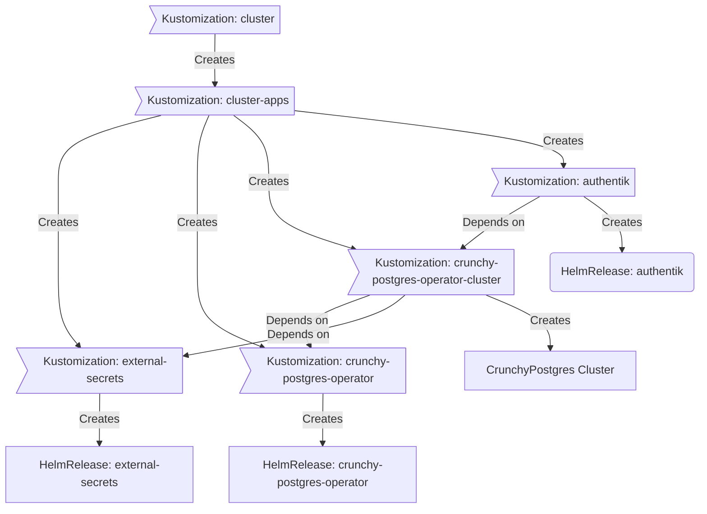

<div align="center">

### My Homelab Repository :snowflake:

_... automated via [Flux](https://fluxcd.io), [Renovate](https://github.com/renovatebot/renovate) and [GitHub Actions](https://github.com/features/actions)_ 🤖

</div>

<div align="center">

[](https://discord.gg/home-operations)&nbsp;&nbsp;
[](https://www.talos.dev/)&nbsp;&nbsp;
[](https://www.talos.dev/)&nbsp;&nbsp;
[](https://fluxcd.io/)&nbsp;&nbsp;

</div>

<div align="center">

[](https://status.ekenhome.se)&nbsp;&nbsp;
[](https://status.ekenhome.se/endpoints/external_gatus)&nbsp;&nbsp;
[](https://status.ekenhome.se/endpoints/external_plex)

</div>

<div align="center">

[](https://github.com/kashalls/kromgo/)&nbsp;&nbsp;
[](https://github.com/kashalls/kromgo/)&nbsp;&nbsp;
[](https://github.com/kashalls/kromgo/)&nbsp;&nbsp;
[](https://github.com/kashalls/kromgo/)&nbsp;&nbsp;
[](https://github.com/kashalls/kromgo/)&nbsp;&nbsp;
[](https://github.com/kashalls/kromgo/)&nbsp;&nbsp;
[](https://github.com/kashalls/kromgo/)

</div>

---

## Overview

This is a monorepository for my home Kubernetes cluster. I try to keep everything defined as code and managed through GitOps — if it's running, it should be in Git. The main tools I rely on are [Ansible](https://www.ansible.com/), [Terraform](https://developer.hashicorp.com/terraform), [Kubernetes](https://kubernetes.io/), [Flux](https://github.com/fluxcd/flux2), [Renovate](https://github.com/renovatebot/renovate), and [GitHub Actions](https://github.com/features/actions).

Started this to learn Kubernetes properly, and it's grown quite a bit since then — it now runs everything from media and smart home automation to a fairly serious data science stack.

---

## ⛵ Kubernetes

### Installation

The cluster runs [Talos Linux](https://www.talos.dev), an immutable, API-driven OS purpose-built for Kubernetes. There's no SSH, no package manager — configuration is entirely declarative via `talconfig.yaml` and applied with [talhelper](https://github.com/budimanjojo/talhelper).

The setup is semi-hyper-converged: workloads and block storage share the same nodes, while a separate NAS handles NFS/SMB shares, bulk storage, and off-cluster backups.

### Core Components

- [actions-runner-controller](https://github.com/actions/actions-runner-controller): self-hosted GitHub Actions runners inside the cluster
- [cilium](https://github.com/cilium/cilium): CNI for internal Kubernetes networking, replacing kube-proxy entirely
- [cert-manager](https://cert-manager.io/docs/): handles SSL certificate issuance and renewal for all cluster services
- [cloudflared](https://github.com/cloudflare/cloudflared): Cloudflare Tunnel for exposing services without opening inbound firewall ports
- [external-dns](https://github.com/kubernetes-sigs/external-dns): automatically creates DNS records from ingress and service definitions
- [external-secrets](https://github.com/external-secrets/external-secrets/): syncs secrets from [Bitwarden](https://bitwarden.com/) into Kubernetes
- [headscale](https://github.com/juanfont/headscale): self-hosted Tailscale control plane for mesh VPN access
- [ingress-nginx](https://github.com/kubernetes/ingress-nginx/): ingress controller using NGINX as a reverse proxy and load balancer
- [openebs](https://openebs.io/): local hostpath storage for workloads that need node-local fast storage
- [rook-ceph](https://rook.io/): distributed block storage across the cluster nodes
- [sops](https://toolkit.fluxcd.io/guides/mozilla-sops/): encrypted secrets committed to Git, used across Kubernetes and Ansible
- [spegel](https://github.com/XenitAB/spegel): peer-to-peer OCI registry mirror so nodes don't all pull images independently
- [tofu-controller](https://github.com/flux-iac/tofu-controller): runs OpenTofu (open-source Terraform) from within the cluster, managed by Flux
- [volsync](https://github.com/backube/volsync): backup and recovery of persistent volume claims

### GitOps

[Flux](https://github.com/fluxcd/flux2) watches the `kubernetes/` folder and reconciles the cluster to match whatever is in Git. It recursively searches for the top-level `kustomization.yaml` in each app directory, which in turn points to `HelmRelease` objects and any supporting resources.

If it's not in Git, it doesn't run — and if it drifts, Flux will bring it back.

[Renovate](https://github.com/renovatebot/renovate) monitors the entire repository for outdated dependencies. When a new chart or image version is available, it opens a PR automatically. Merging that PR is all it takes to trigger a rollout.

### Directories

```sh
📁 .
├── 📁 .devcontainer/    # Development container configuration
├── 📁 .github/          # GitHub Actions workflows
├── 📁 .taskfiles/       # Taskfile configurations
├── 📁 ansible/          # Ansible playbooks for supporting infrastructure (NAS, etc.)
├── 📁 clusterconfig/    # Cluster configuration files
├── 📁 kubernetes/       # Kubernetes manifests
│   ├── 📁 apps/         # Application deployments
│   ├── 📁 bootstrap/    # Bootstrap procedures and Talos config
│   ├── 📁 flux/         # Core Flux configuration
│   └── 📁 templates/    # Reusable components (VolSync, etc.)
└── 📁 terraform/        # Terraform/OpenTofu configurations
```

### Flux Workflow

Here's how Flux handles deployment ordering using real examples from the cluster. `external-secrets` and the Postgres operator have no dependencies so they come up immediately. The Postgres cluster waits for both of those to be healthy, and only then can `authentik` start — since it needs a running database before it can do anything useful.


```mermaid
graph TD;
  id1>Kustomization: cluster] -->|Creates| id2>Kustomization: cluster-apps];
  id2>Kustomization: cluster-apps] -->|Creates| id3>Kustomization: external-secrets];
  id2>Kustomization: cluster-apps] -->|Creates| id4>Kustomization: crunchy-postgres-operator];
  id2>Kustomization: cluster-apps] -->|Creates| id6>Kustomization: crunchy-postgres-operator-cluster];
  id2>Kustomization: cluster-apps] -->|Creates| id8>Kustomization: authentik];
  id3>Kustomization: external-secrets] -->|Creates| id5[HelmRelease: external-secrets];
  id4>Kustomization: crunchy-postgres-operator] -->|Creates| id7[HelmRelease: crunchy-postgres-operator];
  id6>Kustomization: crunchy-postgres-operator-cluster] -->|Depends on| id4>Kustomization: crunchy-postgres-operator];
  id6>Kustomization: crunchy-postgres-operator-cluster] -->|Depends on| id3>Kustomization: external-secrets];
  id6>Kustomization: crunchy-postgres-operator-cluster] -->|Creates| id9[CrunchyPostgres Cluster];
  id8>Kustomization: authentik] -->|Depends on| id6>Kustomization: crunchy-postgres-operator-cluster];
  id8>Kustomization: authentik] -->|Creates| id10(HelmRelease: authentik);
```

---

## 🗂️ Applications

The cluster runs a wide range of workloads, organized by namespace:

### Data Science
A fairly deep ML/data stack with [Ray](https://www.ray.io/) and [Dask](https://www.dask.org/) for distributed compute, [Apache Spark](https://spark.apache.org/) for large-scale processing, and [Dagster](https://dagster.io/), [Prefect](https://www.prefect.io/), and [Flyte](https://flyte.org/) for orchestration. [MLflow](https://mlflow.org/) handles experiment tracking, [Jupyter Lab](https://jupyter.org/) and [Marimo](https://marimo.io/) for interactive notebooks. [Kubeflow](https://www.kubeflow.org/) is deployed and being migrated from deployKF to a native install. On the AI/inference side: [Ollama](https://ollama.com/), [vLLM](https://github.com/vllm-project/vllm), [Open WebUI](https://github.com/open-webui/open-webui), and [Langflow](https://langflow.org/) for building LLM workflows. [Qdrant](https://qdrant.tech/) serves as the vector database.

### Smart Home / IoT
[Home Assistant](https://www.home-assistant.io/) is the hub, with [Z-Wave JS UI](https://github.com/zwave-js/zwave-js-ui) handling Z-Wave devices. [Music Assistant](https://music-assistant.io/) manages multi-room audio. All backed by a local [Mosquitto](https://mosquitto.org/) MQTT broker.

### Media
[Plex](https://www.plex.tv/) for media streaming, with [Kavita](https://www.kavitareader.com/) for books and comics. [Overseerr](https://overseerr.dev/) handles requests, [Maintainerr](https://github.com/jorenn92/Maintainerr) handles library cleanup, and the usual *arr stack ([Sonarr](https://sonarr.tv/), [Radarr](https://radarr.video/), [Prowlarr](https://github.com/Prowlarr/Prowlarr), [SABnzbd](https://sabnzbd.org/)) manages downloads.

### Personal / Productivity
[Immich](https://immich.app/) for photo management, [Paperless-ngx](https://docs.paperless-ngx.com/) for documents, [Syncthing](https://syncthing.net/) for file sync, and [Actual Budget](https://actualbudget.org/) for personal finance.

### Observability
Full monitoring stack: [kube-prometheus-stack](https://github.com/prometheus-community/helm-charts/tree/main/charts/kube-prometheus-stack) with [Grafana](https://grafana.com/), long-term metrics via [Thanos](https://thanos.io/), external health monitoring with [Gatus](https://gatus.dev/), and [Kromgo](https://github.com/kashalls/kromgo) for the README badges above.

### Development / Internal Tools
[Harbor](https://goharbor.io/) as a private OCI registry, [Meilisearch](https://www.meilisearch.com/) for search, [Redpanda](https://redpanda.com/) as a Kafka-compatible event streaming platform, and [Metabase](https://www.metabase.com/) for business intelligence dashboards.

---

## ☁️ Cloud Dependencies

Most things run locally, but I offload a few things to the cloud where it makes sense — either to avoid chicken-and-egg problems at boot time, or because they need to be available even when the cluster is down.

| Service                                   | Use                                                               | Cost           |
|-------------------------------------------|-------------------------------------------------------------------|----------------|
| [Bitwarden](https://bitwarden.com/)       | Secrets with [External Secrets](https://external-secrets.io/)     | ~$10/yr        |
| [Cloudflare](https://www.cloudflare.com/) | Domain and S3                                                     | ~$30/yr        |
| [GitHub](https://github.com/)             | Hosting this repository and continuous integration/deployments    | Free           |
| [Healthcheck.io](https://healthcheck.io/) | Monitoring internet connectivity and external facing applications | Free           |
|                                           |                                                                   | Total: ~$3.33/mo  |

---

## 🔧 Hardware

### Main Kubernetes Cluster

| Name    | Device        | CPU      | OS Disk   | Data Disk | RAM   | OS    | Purpose           | Status   |
|---------|---------------|----------|-----------|-----------|-------|-------|-------------------|----------|
| master1 | Dell 7080mff  | 16 cores | 113GB SSD | 1TB NVMe  | 64GB  | Talos | k8s control-plane | Ready    |
| master2 | Dell 7080mff  | 16 cores | 233GB SSD | 1TB NVMe  | 64GB  | Talos | k8s control-plane | Ready    |
| master3 | Dell 3080mff  | 16 cores | 233GB SSD | 1TB NVMe  | 64GB  | Talos | k8s control-plane | Ready    |
| worker3 | AMD (32-core) | 32 cores | 101GB SSD | 1TB NVMe  | 96GB  | Talos | k8s worker        | Ready    |

Total CPU: 80 cores
Total RAM: 288GB

### Supporting Hardware

| Name  | Device         | CPU           | OS Disk      | Data Disk | RAM   | OS       | Purpose               |
|-------|----------------|---------------|--------------|-----------|-------|----------|-----------------------|
| NAS   | Gigabyte C246M | E5-2680v2     | 32GB USB     | 78TB      | 128GB | Unraid   | NAS/NFS/Backup        |

### Networking/UPS Hardware

| Device                    | Purpose                               |
|---------------------------|---------------------------------------|
| Rellio 2200 VSD           | UPS - Server Rack                     |
| Unifi Dream Machine Pro   | Router / Gateway                      |
| Unifi USW Pro XG 24 PoE  | 24 Port 10G PoE Switch (main rack)    |
| Unifi USW 16 PoE          | 16 Port PoE Switch                    |
| Unifi USW Lite 16 PoE     | 16 Port Lite PoE Switch               |
| Unifi US 8                | 8 Port Switch                         |
| Unifi US 8                | 8 Port Switch                         |
| Unifi U7 Pro XGS          | WiFi 7 Access Point                   |
| Unifi AC Pro              | Access Point                          |

---

## 🤝 Thanks

Big shout out to original [cluster-template](https://github.com/onedr0p/cluster-template), and the [Home Operations](https://discord.gg/home-operations) Discord community.

Be sure to check out [kubesearch.dev](https://kubesearch.dev/) for ideas on how to deploy applications or get ideas on what you may deploy.

---

## 📜 Changelog

See my _awful_ [commit history](https://github.com/ekenheim/home-ops-upgrade/commits/main)

---

## 🔏 License

See [LICENSE](./LICENSE)
